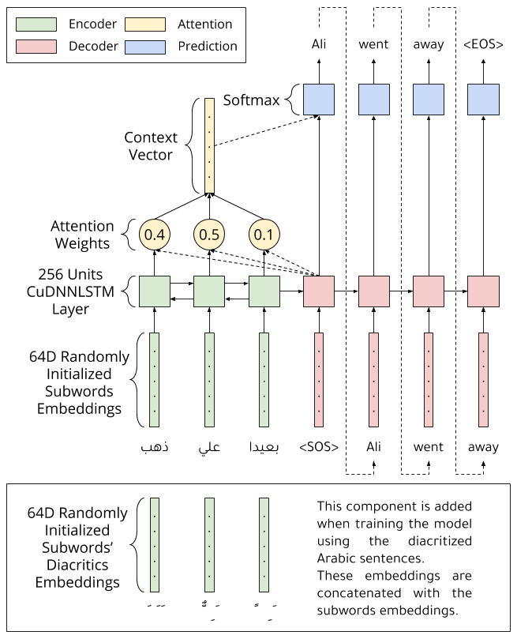

# Translation-over-Diacritization

This repository contains the Translation-over-Diacritization technique implementation used in our paper on Arabic Text Diacritization:

"Neural Arabic Text Diacritization: Outperforming State of the Art Using FFNN and RNN", Ali Fadel, Ibraheem Tuffaha, Mahmoud Al-Ayyoub and Bara' Al-Jawarneh, [ACL 2019](http://www.acl2019.org).

## 0. Prerequisites
- Python 3.6.8
- Packages listed in `requirements.txt` file
- Download the following Arabic-English parallel corpora from [OPUS](http://opus.nlpl.eu) project and extract them in `data_dir/tmx` folder:
  - [GlobalVoices v2017q3](https://object.pouta.csc.fi/OPUS-GlobalVoices/v2017q3/tmx/ar-en.tmx.gz)
  - [MultiUN v1](https://object.pouta.csc.fi/OPUS-MultiUN/v1/tmx/ar-en.tmx.gz)
  - [News-Commentary v11](https://object.pouta.csc.fi/OPUS-News-Commentary/v11/tmx/ar-en.tmx.gz)
  - [Tatoeba v2](https://object.pouta.csc.fi/OPUS-Tatoeba/v2/tmx/ar-en.tmx.gz)
  - [TED2013 v1.1](https://object.pouta.csc.fi/OPUS-TED2013/v1.1/tmx/ar-en.tmx.gz)
  - [Ubuntu v14.10](https://object.pouta.csc.fi/OPUS-Ubuntu/v14.10/tmx/ar-en.tmx.gz)
  - [Wikipedia v1.0](https://object.pouta.csc.fi/OPUS-Wikipedia/v1.0/tmx/ar-en.tmx.gz)
- Clone [Shakkelha](https://github.com/AliOsm/shakkelha) and place it in the same folder with this repository
- Clone [mosesdecoder](https://github.com/moses-smt/mosesdecoder) and place it in the same folder with this repository

## 1. Data Extraction
To extract the data run the following command:
```
python 1_extract_data.py
```

## 2. Data Preparing and Splitting
To prepare, segment (using Byte Pair Encoding), and split the data into training and testing run the following command:
```
sh 2_prepare_data.sh
```

## 3. Remove Long Lines
Little lines gains a lot of tokens after the segmentation process in step 2, so run the following command to remove them:
```
python 3_remove_long_lines.py
```

## 4. Diacritize Arabic Data
To diacritize the Arabic data extracted in step 1 run the following command:
```
sh 4_diacritize_ar_data.sh
```

## 5. Merge Diacritics with Segmented Text
To merge the diacritics from the diacritized Arabic text gained from step 4 with the segmented Arabic text run the following command:
```
python 5_merge_diacritics_with_bpe.py
```

## 6. Train the Model
To train the model run the following command:
```
python 6_seq2seq.py
```
You can choose to train the model with or without diacritics by changing the value of `USE_DIACS` constant.

## 7. Untokenize Predicted Translations (Remove BPE special characters)
To untokenize the predicted translations run the following command:
```
sh 7_untok_predictions.sh
```

## 8. Calculate BLEU scores
To calculate the BLEU scores run the following command:
```
sh 8_calculate_bleu.sh
```

## Model Structure

The following figure shows the model structure in a clearer way.


#### Note: All codes in this repository tested on [Ubuntu 18.04](http://releases.ubuntu.com/18.04)

## Contributors
1. [Ali Hamdi Ali Fadel](https://github.com/AliOsm).<br/>
2. [Ibraheem Tuffaha](https://github.com/IbraheemTuffaha).<br/>
3. [Mahmoud Al-Ayyoub](https://github.com/malayyoub).<br/>

## License
The project is available as open source under the terms of the [MIT License](https://opensource.org/licenses/MIT).
